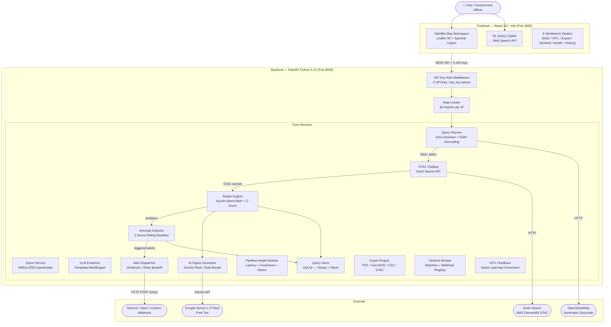

# SatQuery AI — System Architecture

## Architecture Diagram

```mermaid
graph TB
    USER(["👤 User / Government Officer"])
    
    subgraph Frontend ["Frontend — React 18 + Vite (Port 3000)"]
        UI["Satellite Map Workspace\nLeaflet 3D + Spectral Layers"]
        COPILOT["NL Query Copilot\nWeb Speech API"]
        STUDIOS["6 Workbench Studios\n(DAG / HITL / Export / Sentinel / Health / History)"]
    end
    
    USER --> UI
    USER --> COPILOT
    
    subgraph Backend ["Backend — FastAPI Python 3.12 (Port 8000)"]
        AUTH["API Key Auth Middleware\nX-API-Key / api_key param"]
        RATE["Rate Limiter\n60 req/min per IP"]
        
        subgraph Services ["Core Services"]
            PLANNER["Query Planner\nDAG Resolver + OSM Geocoding"]
            CATALOG["STAC Catalog\nEarth Search API"]
            RASTER["Raster Engine\nNumPy Band Math + Z-Score"]
            VISION["Vision Service\nSIMULATED placeholder"]
            VLM["VLM Evidence\nTemplated Multilingual"]
            DIGEST["AI Digest Generator\nGemini Flash / Rule-Based"]
            ANOM["Anomaly Detector\nZ-Score Rolling Baseline"]
            DISPATCH["Alert Dispatcher\nWebhook + Retry Backoff"]
            HEALTH["Pipeline Health Monitor\nLatency + Freshness + Status"]
            STORE["Query Store\nSQLite — History + Alerts"]
            EXPORT["Export Engine\nPDF / GeoJSON / CSV / STAC"]
            SENTINEL["Sentinel Monitor\nWatchlist + Webhook Registry"]
            HITL["HITL Feedback\nActive Learning Corrections"]
        end
    end
    
    Frontend -->|REST API + X-API-Key| AUTH
    AUTH --> RATE
    RATE --> PLANNER
    PLANNER -->|bbox, dates| CATALOG
    CATALOG -->|STAC scenes| RASTER
    RASTER -->|analytics| ANOM
    ANOM -->|triggered alerts| DISPATCH
    DISPATCH -->|"HTTP POST (retry)"| WEBHOOK(["Discord / Slack / Custom Webhook"])
    RASTER --> DIGEST
    DIGEST -->|Gemini API| LLM(["Google Gemini 1.5 Flash\nFree Tier"])
    RASTER --> STORE
    ANOM --> STORE
    
    subgraph External
        STAC_API(["Earth Search\nAWS Element84 STAC"])
        OSM(["OpenStreetMap\nNominatim Geocoder"])
        LLM
        WEBHOOK
    end
    
    CATALOG -->|HTTP| STAC_API
    PLANNER -->|HTTP| OSM
```
